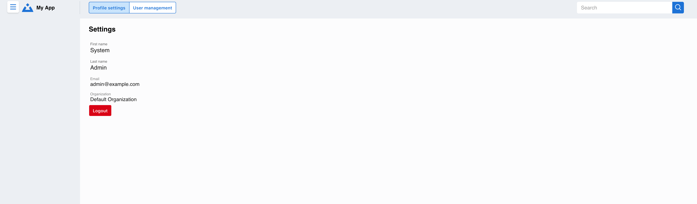

.. _profile_settings:

Profile Settings
================

Customize your Buildly Product Labs experience by managing your personal profile, preferences, and account settings. The profile settings allow you to tailor the platform to your working style and communication needs.

Accessing Profile Settings
--------------------------

To access your profile settings:

1. Click on your profile avatar or name in the top navigation
2. Select "Profile Settings" or "Account Settings" from the dropdown menu
3. You'll be taken to your personal settings dashboard

Personal Information
--------------------

**Basic Profile Details**
  Update your core profile information:
  
  - **Full Name** - Display name shown to other users
  - **Email Address** - Used for login and notifications
  - **Job Title** - Your role within the organization
  - **Department** - Team or department association
  - **Phone Number** - Contact information (optional)
  - **Profile Picture** - Upload a photo or avatar

**Bio and Expertise**
  - **About Me** - Brief description of your role and expertise
  - **Skills and Interests** - Help team members understand your capabilities
  - **Time Zone** - Ensures accurate scheduling and deadline displays
  - **Preferred Language** - Interface language preference

Account Preferences
-------------------

**Notification Settings**
  Customize how and when you receive updates:
  
  - **Email Notifications** - Choose which emails you want to receive
  - **In-App Notifications** - Control desktop and mobile alerts
  - **Digest Frequency** - Daily, weekly, or custom summary emails
  - **Quiet Hours** - Set times when you don't want to be disturbed

**Dashboard Customization**
  Personalize your dashboard experience:
  
  - **Default View** - Choose your preferred landing page
  - **Widget Layout** - Arrange dashboard components
  - **Data Refresh Rate** - How often information updates
  - **Favorite Projects** - Pin frequently accessed projects

**AI Assistant Preferences**
  Configure your BabbleBeaver AI experience:
  
  - **AI Suggestions** - Enable/disable intelligent recommendations
  - **Learning Permissions** - What data the AI can use to help you
  - **Interaction Style** - Formal, casual, or technical communication
  - **Automation Level** - How much the AI should automate for you

Security Settings
-----------------

**Password Management**
  Maintain account security:
  
  - **Change Password** - Update your login credentials
  - **Two-Factor Authentication** - Add extra security to your account
  - **Login History** - View recent access to your account
  - **Active Sessions** - Manage where you're currently logged in

**Privacy Controls**
  Manage your data and visibility:
  
  - **Profile Visibility** - Control who can see your information
  - **Activity Sharing** - Choose what activities are visible to others
  - **Data Export** - Download your personal data
  - **Account Deletion** - Request removal of your account

Integration Settings
--------------------

**Connected Accounts**
  Link external services and tools:
  
  - **Calendar Integration** - Connect Google Calendar, Outlook, etc.
  - **Communication Tools** - Link Slack, Microsoft Teams, etc.
  - **Development Tools** - Connect GitHub, GitLab, Jira, etc.
  - **Cloud Storage** - Link Google Drive, Dropbox, OneDrive

**API Access**
  For advanced users:
  
  - **Personal Access Tokens** - Generate tokens for third-party integrations
  - **Webhook URLs** - Configure external notifications
  - **OAuth Applications** - Manage connected applications

Team and Collaboration
----------------------

**Team Memberships**
  View and manage your team associations:
  
  - **Current Teams** - Teams you're a member of
  - **Pending Invitations** - Teams you've been invited to join
  - **Team Roles** - Your permissions within each team
  - **Team Preferences** - How you interact with different teams

**Collaboration Preferences**
  Configure how you work with others:
  
  - **Availability Status** - Show when you're available for collaboration
  - **Working Hours** - Your typical schedule for better coordination
  - **Communication Style** - Preferences for meetings, messages, etc.
  - **Expertise Sharing** - Areas where you can help other team members

Tips for Optimizing Your Profile
--------------------------------

**Best Practices**

1. **Complete Your Profile**
   - Add a professional photo and comprehensive bio
   - Keep your contact information current
   - Update your skills and expertise regularly

2. **Customize Notifications**
   - Start with default settings and adjust based on your needs
   - Use quiet hours to maintain work-life balance
   - Set up digest emails to reduce notification overload

3. **Leverage AI Features**
   - Allow BabbleBeaver to learn from your patterns
   - Regularly review and adjust AI recommendations
   - Provide feedback to improve AI accuracy

4. **Maintain Security**
   - Use strong, unique passwords
   - Enable two-factor authentication
   - Regularly review your login history and active sessions

5. **Stay Connected**
   - Link your frequently used tools and services
   - Keep your team memberships current
   - Update your availability and working hours

Troubleshooting Profile Issues
------------------------------

**Common Problems**

- **Can't Update Information**: Check with your administrator about permission settings
- **Notifications Not Working**: Verify email settings and check spam folders
- **Integration Failures**: Reauthorize connected services and check credentials
- **Profile Picture Issues**: Ensure image meets size and format requirements

**Getting Help**
  - Contact your system administrator for permission-related issues
  - Use the platform's help system for technical problems
  - Check the :doc:`../troubleshooting/CORS-RESOLUTION-SUMMARY` for common technical issues

Related Documentation
--------------------

- :doc:`user_management` - Team and permission management
- :doc:`ai_features` - Customizing your AI experience
- :doc:`../user-guide/BUILDLY-USER-DOCUMENTATION` - Complete platform guide

.. note::
   Profile settings may vary based on your organization's configuration and your role permissions. Contact your administrator if you need access to additional settings or features.
